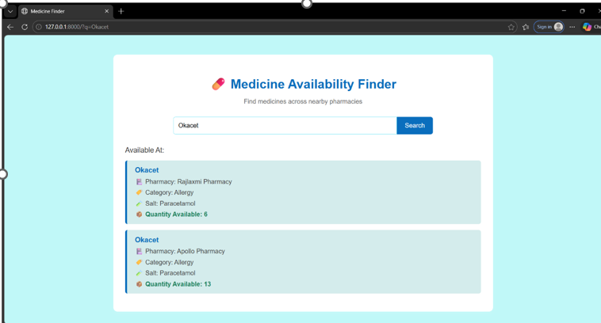
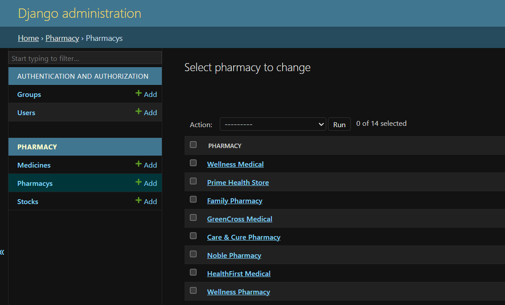
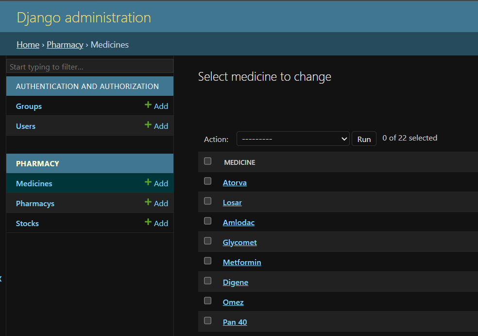
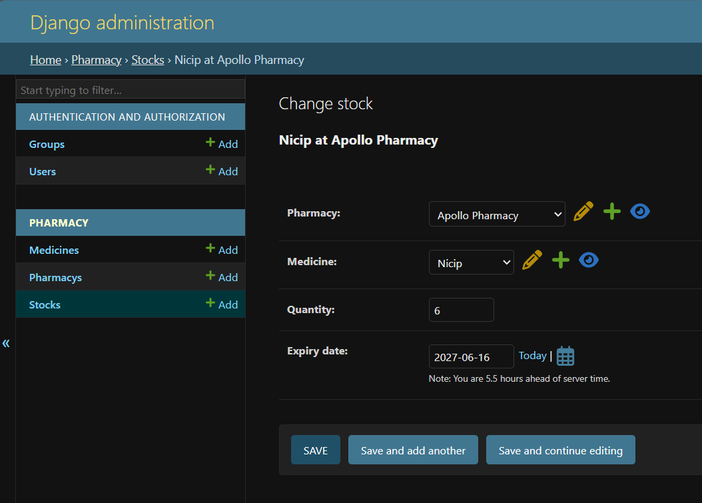

# 💊 Medicine Availability Finder

A Django-based web application that helps users search and check medicine availability across pharmacies with location and stock details.

---

## 🚀 Features
- Medicine Search
- Pharmacy Availability
- Stock Quantity Display
- User-Friendly Interface

---

## 🛠️ Technologies Used
- Python
- Django
- HTML
- CSS
- JavaScript
- SQLite / MySQL

---

## ⚙️ Run Project

```bash
python manage.py runserver
```

---


## 📸 Screenshots

### Home Page


### Pharmacy Information


### Medicine Information


### Adding Medicine with Pharmacy Information



## 🔗 GitHub Repository

](https://github.com/nitishnarule-hub/Medicine-Availability-Finder)
